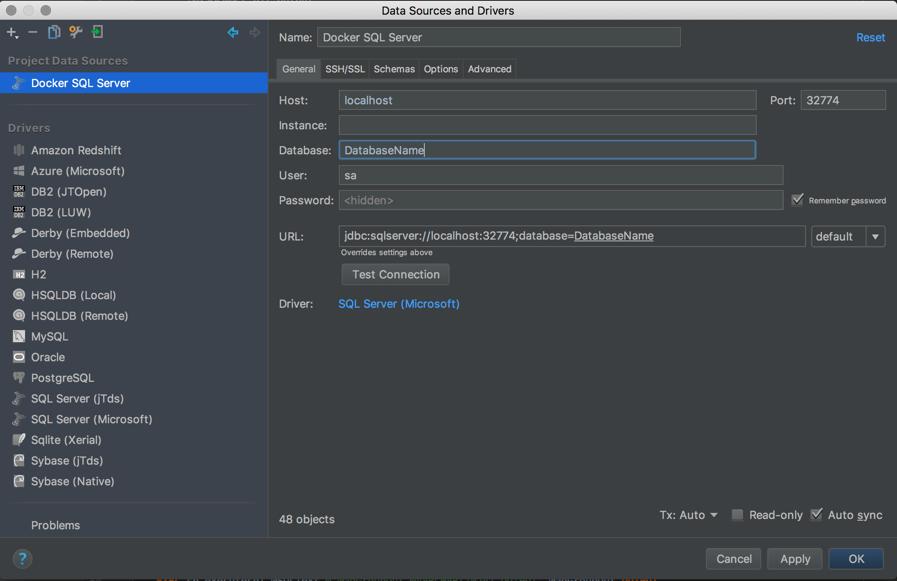

1. Get [Docker](https://www.docker.com/) (if it is not already running)

1. Get the SQL Server on Linux for Docker Engine image

   I'm running Docker on MacOS, I will use the SQL Server on Linux for Docker Engine at [Docker Hub](https://hub.docker.com/r/microsoft/mssql-server-linux/)

   ```
   docker pull microsoft/mssql-server-linux
   ```

1. Set the settings and start the container

   SQL Server on Linux for Docker Engine requires an environment setting to accept the EULA and set a strong SA password:

   ```
   ACCEPT_EULA = Y
   SA_PASSWORD = <your password>
   ```

   Run this in the terminal:

   ```
   docker run -e 'ACCEPT_EULA=Y' -e 'SA_PASSWORD=yourStrong(!)Password' -p 1433:1433 -d microsoft/mssql-server-linux
   ```


1. Copy a backup to the container

   ```
   docker cp '/tmp/DatabaseName.bak' mssql-server-linux:/tmp
   ```

1. Restore the backup

   ```
   RESTORE DATABASE DatabaseName FROM DISK='/tmp/DatabaseName.bak'
   WITH MOVE 'DatabaseName' TO '/var/opt/mssql/data/DatabaseName.MDF',
   MOVE 'DatabaseName_log' TO '/var/opt/mssql/data/DatabaseName_log.ldf'
   Go
   ```

1. Connect with a docker command or an IDE like [DataGrip](https://www.jetbrains.com/datagrip/)



Using SQL Server for Linux in Docker has allowed me to continue to develop using a Linux distro or macOS without needing to set up a VM to run the database backend.