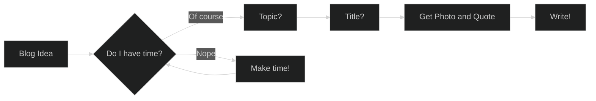

## Mermaid for Diagramming

Always in search of good tooling - robust, compatible, extendible - for diagrams.  Mermaid.js looked like something cool for code based diagramming.  This week, Github announced support for Mermaid.js in its documentation, [Github markdown supports Mermaid.js](https://github.blog/2022-02-14-include-diagrams-markdown-files-mermaid/).

### Blogging flow chart example

### References

[Mermaid.js on Github](https://mermaid-js.github.io/mermaid/#/)

[Gatsby Mermaid Tooling](https://www.gatsbyjs.com/plugins/gatsby-remark-mermaid/)

[Visual Studi Code Preview Extension](https://marketplace.visualstudio.com/items?itemName=bierner.markdown-mermaid)

### Image Credit

Photo by <a href="https://unsplash.com/@kaleidico?utm_source=unsplash&utm_medium=referral&utm_content=creditCopyText">Kaleidico</a> on <a href="https://unsplash.com/s/photos/diagram?utm_source=unsplash&utm_medium=referral&utm_content=creditCopyText">Unsplash</a>
  
### Quote Credit

"Albert Einstein Quotes." BrainyQuote.com. BrainyMedia Inc, 2022. 17 February 2022. from [BrainyQuote.com](https://www.brainyquote.com/quotes/albert_einstein_117103)
