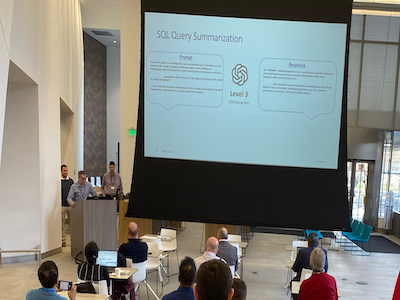

## Guardrails Presentation for DAMA Philadelphia at PennDNA, Penn Medicine

<!--  -->

     

          
     

     

          
     

**Guardrails:  “Secure Data Retrieval Augmentation for Generative Learning**

I presented at the DAMA Philadelphia meeting on 3/13/2024, [March 2024 DAMA Philadelphia Analytics, LLM And AI Day](https://dama-phila.org/meetinginfo.php?id=23&ts=1709652574).  The conference was held at Penn Medicine in an interesting conference hall, open to all.

"DAMA Philadelphia hosts five full day chapter meetings per year, every other month from September through May. There are additional professional development opportunities, such as instructor led training, seminars and certification camps. These special events are priced separately at a discounted rate. Networking functions are held after select meetings and events."

### What do I mean by Guardrails?

**Guardrails** are the rules, protocols, legal and ethical guidelines put in place to ensure the responsible deployment and use of large language models.

This context has been discussed as a public coexistence with generative technology, however, we see the future as a proliferation of models and integrations, each with conditions and requirements, directions and access concerns.

In the context of corporate data governance, there will be a need for well defined, configurable and observable generative solutions.

We see the future of databases to offer generation tools as features as models get smaller, portable.

Finally, we see generative technology as a productive, but not decision-making technology (for now).

### Future Work

Continue researching AI and security and best practices, highlighting the significance of Large Language Models (LLMs), Retrieval-Augmented Generation (RAG), actuating devices, and the critical role of security in intelligent solutions.

#### Guardrails in products and solutions
- Configurable, transparent, extensible, control of generative tools
- Define, refine and focus on OBSERVABILTY!
#### Challenges and Opportunities
- Anticipate challenges in securing future LLMs and RAG systems.
- Identify opportunities for research and development in secure generation.
#### Continuous Risk Assessment and Threat Modeling
- New and Novel techniques, processes, paradigms are being adopted at breakneck speed
- We need to continuous evaluate LLMs, RAG technology, 
coexistence" and processes in your organization and understand data flows.

## Call-to-Action
- Reach out to me, let's talk about your ideas and knowledge.
- Keep reading, experimenting, prototyping - we are at the starting line.

