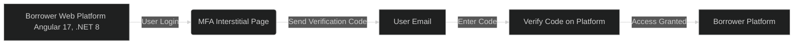
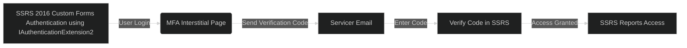
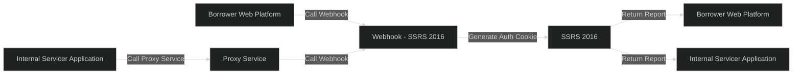

## Introduction

In today's digital landscape, Multi-Factor Authentication (MFA) has become a critical requirement for ensuring the security of applications and safeguarding sensitive data. With increasing cyber threats, relying solely on passwords is no longer sufficient. MFA adds an additional layer of security by requiring users to verify their identity through multiple methods, such as receiving a code via email or SMS, before gaining access to an application.

Recently, I had the opportunity to deliver MFA solutions for a client across three distinct platforms. Each project presented unique challenges, but the ultimate goal was the same: to enhance the security of the client's data and applications.

## The Approach

### 1. Upgrading the Borrower Web Platform

&nbsp;
&nbsp;

&nbsp;
&nbsp;

The first solution in the MFA enablement project was to add MFA to the borrower web application. However, during the initial stages of implementation, I discovered that the platform was running on outdated Angular and C# WebAPI code, which posed significant security risks and performance limitations. This discovery prompted a full platform modernization, where I upgraded the application from Angular 7 to Angular 17 and migrated the C# WebAPI from .NET 4.5 to .NET 8. This upgrade not only improved security and runtime performance but also enhanced developer efficiency and ensured continued support, as the older code had numerous deprecations. Following this modernization effort, I successfully integrated an MFA interstitial verification process, which sends a verification code to the borrower via email. The borrower must then enter this code on the platform, adding an essential layer of security to ensure that only authorized users can access sensitive information.

### 2. Enhancing Internal Applications

&nbsp;
&nbsp;

&nbsp;
&nbsp;

The second project focused on adding MFA verification to an internal application used for servicing and contracts. This application was built on an older version of VB.NET, making the integration of modern MFA capabilities a challenge. However, by implementing a tailored MFA solution, I was able to enhance the security of the internal processes without disrupting the legacy system.

### 3. Custom Authentication and Authorization for SSRS 2016

&nbsp;
&nbsp;

&nbsp;
&nbsp;

The third project was particularly challenging, requiring the creation of a custom Authentication and Authorization extension for SQL Server Reporting Services (SSRS) 2016. The client needed to transition from NTLM authentication to Forms authentication, but due to the age of SSRS 2016 and its low support, this wasn’t a straightforward task.

I added project time to conduct extensive research, navigating through limited documentation and resources. Given the age of the platform, finding support was difficult. I reached out to Microsoft engineers, but most were specialized in Azure or Power BI and were not familiar with implementing custom authentication solutions for SSRS 2016.

Eventually, I came across a Microsoft GitHub project that provided skeleton code for implementing a custom authentication extension using IAuthenticationExtension2 and IAuthorizationExtension. Although the documentation was sparse and required a fair amount of interpretation, it served as a critical starting point. I worked through the code, making the necessary modifications and adjustments to fit the client’s specific needs. After several iterations and testing, I was able to develop an excellent solution that met the client’s requirements.

The solution involved creating an MFA interstitial page that emails a verification code to university lenders. These lenders then enter the code on the interstitial page to access the reporting services, ensuring that only verified users can view sensitive reports. This added layer of security was a significant enhancement to the client’s existing setup.

For those interested in the technical details, the GitHub project that served as the foundation for this solution can be found [here](https://github.com/microsoft/Reporting-Services/tree/master/CustomSecuritySample2016). By leveraging this project and building upon it, I was able to deliver a robust and secure authentication mechanism for SSRS 2016, despite the challenges posed by the platform’s age and limited support.

## Platform Integration

### Added Integration for SSRS 2016 Authentication

In addition to the custom authentication and MFA solution for SSRS 2016, I also needed to integrate this system with other applications within the client's ecosystem. Specifically, the Borrower Web Platform and the Internal Servicer Application required the ability to generate reports from SSRS within their own environments. To facilitate this, I created a webhook that handled authentication requests from these applications.

The webhook was designed to create a `CookieCollection` and generate an authentication cookie for each application. This cookie would then be used to authenticate the application's requests to SSRS, allowing them to generate reports seamlessly.

To implement this solution, I set up a service account that bypassed MFA verification. This service account was used by a proxy service created for the Internal Servicer Application, which was unable to call the webhook directly due to its legacy architecture. The Borrower Web Platform, being more modern and built on Angular, could call the webhook directly without requiring a proxy.

This integration allowed both applications to securely access SSRS for report generation while maintaining a consistent authentication flow across the client's platforms.

### MermaidJS Diagram

Here's a MermaidJS diagram to illustrate the integration:

This diagram shows the flow from each application calling the SSRS webhook to generate the authentication cookie, allowing them to retrieve reports within their own platforms. The inclusion of the proxy service for the internal application highlights the solution's adaptability to different technologies within the client's environment.

## Future State

While these three projects have significantly improved security across different platforms, the next step is to consolidate MFA verification into a single platform. This platform will serve as a unified MFA service that can be utilized by every application across the enterprise. By centralizing the MFA process, we can streamline the user experience and simplify future integrations.

## Conclusion

By implementing MFA across these three platforms, I have added a significant measure of security to my client's data, applications, and platforms. As cyber threats continue to evolve, it's essential to stay ahead of potential vulnerabilities. MFA is a crucial component of a comprehensive security strategy, and its successful implementation demonstrates a commitment to protecting sensitive information.

## Final Note

As a final note, I used ChatGPT to assist with drafting this blog post, helping to organize and articulate the details of the work I’ve completed. However, I want to emphasize that the solutions, integrations, and custom implementations described here are entirely my own. The research, development, and execution were based on my expertise and tailored to meet my client’s specific needs. ChatGPT served as a tool to enhance the clarity and presentation of this content, but the technical work and solutions are my own.

## References

- [Microsoft Sql Server Reporting Services - Custom Security for 2016](https://github.com/microsoft/Reporting-Services/tree/master/CustomSecuritySample2016)

## Credits

### Quote

- "Security is not a product, but a process." — Bruce Schneier ([source](https://www.schneier.com/))
