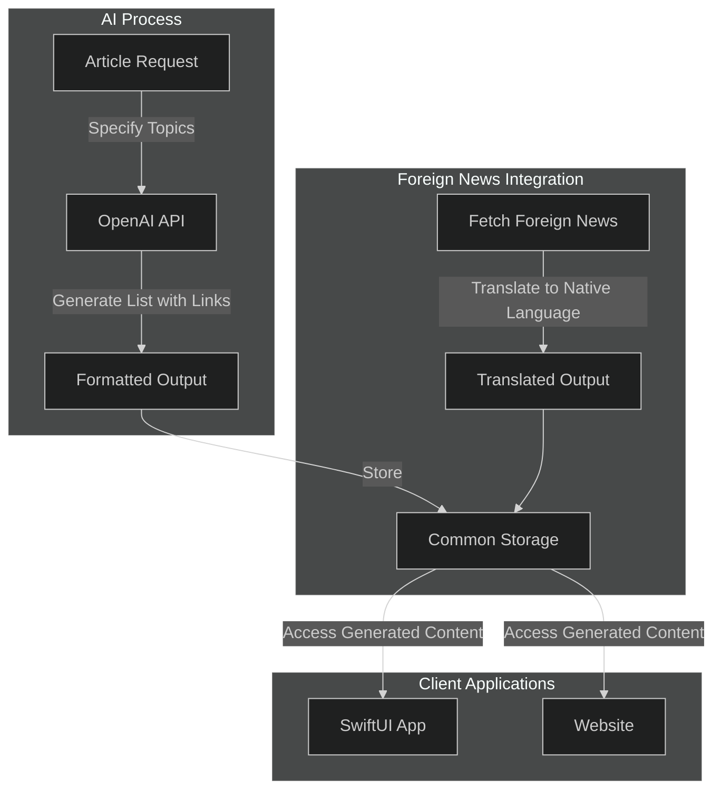

## Briefing: An AI-Powered Tool to Stay Informed and Master Knowledge

### Introduction: The Need for Smarter Tools

In an age of information overload, professionals are inundated with news, updates, and data from countless sources. The sheer volume of information makes it nearly impossible to stay fully informed without spending hours sorting through irrelevant or repetitive content. Whether you’re a cybersecurity expert tracking the latest vulnerabilities or an analyst monitoring global trends, the challenge is the same: finding and acting on the information that truly matters.

This is where AI-powered tools can step in as powerful allies. By acting as a filter, AI can cut through the noise, curating only the most relevant and impactful insights. Imagine starting your day with bullet points tailored to your profession or interests—knowledge from today’s top articles, project updates, and emerging trends—delivered at a glance. No clutter, no distractions—just the essential knowledge to guide your work and decisions.

But Briefing doesn’t stop there. It evolves beyond just delivering knowledge; it aims to become a professional information manager, transforming insights into action items. By integrating curated news and project data, Briefing can help professionals tie their daily knowledge to actionable tasks, providing clarity on what needs to be done. Furthermore, through retrospective features, Briefing will allow users to reflect on the work completed, tying project actions back to the knowledge and updates that informed them.

From starting the day with curated insights to reviewing progress and status, Briefing bridges the gap between knowledge and action, empowering professionals to not only stay informed but also to stay productive and strategic. It’s not just about knowing what’s happening—it’s about using that knowledge effectively.

### The Vision for Briefing

The core purpose of Briefing is to empower professionals by turning information into actionable expertise. In a world where staying ahead requires both breadth and depth of knowledge, Briefing provides a streamlined solution: curated, AI-generated content tailored to your areas of interest. Whether it’s the latest in cybersecurity, geopolitical updates, or industry-specific trends, Briefing delivers the insights that matter most—directly to your fingertips.

Modern productivity demands tools that not only help us access information but also make it usable. Briefing is designed to align with these needs by acting as both a knowledge curator and a professional assistant. It enables users to start their day with concise, relevant summaries of key topics, eliminating the time wasted sifting through irrelevant data. As the app evolves, it will integrate this curated content with project management workflows, transforming knowledge into clear action plans.

By combining the power of AI with a focus on clarity and usability, Briefing bridges the gap between acquiring knowledge and applying it effectively, making it an essential tool for modern professionals striving to stay informed and productive in an ever-changing world.

### Behind the Scenes: The Knowledge Architecture

On a scheduled task, the acquisition process is responsible for:

* Calling an AI to generate topic-specific articles with links.
* Fetching foreign news in native languages and translating it.
* Using structured outputs (JSON/Markdown) for consistency.
* Moving content to common storage for easy access.
* Keep the explanation simple but technical enough to appeal to a tech-savvy audience.

#### Overview

### Roadmap: What’s Next for Briefing

This post is just the beginning. In future installments on my blog, I’ll dive deeper into key aspects of Briefing’s development and vision, including its user experience, real-world applications, and the challenges I’m tackling along the way. Here’s a preview of what’s to come:

1. *The User Experience: Bridging AI and Accessibility*
	•	Explore how Briefing is designed to make curated information easy to access and use, whether through the SwiftUI app or the web platform. I’ll share how intuitive interfaces ensure users can quickly browse topics, view insights, and stay informed with minimal effort.

2. *Real-World Applications: Turning Knowledge into Action*
	•	Highlight how professionals across different fields can use Briefing to stay ahead of trends, enhance productivity, and drive decision-making. From cybersecurity experts to global analysts, I’ll showcase examples of how Briefing translates knowledge into impactful actions.

3. *Challenges and Next Steps: Innovating for the Future*
	•	Share the technical and conceptual challenges I’m addressing, from ensuring AI-generated content is accurate and reliable to integrating deeper project management and retrospective features. I’ll also discuss upcoming milestones, new features, and opportunities for collaboration.

Stay tuned for these posts and more insights into the journey of building Briefing. If you’re as excited about the possibilities as I am, I’d love for you to follow along, share your thoughts, and be part of shaping the future of this project.

### Call to Action: Join the Journey

Briefing is more than just an app or a website, it is a vision for smarter, more effective knowledge management. As we continue to develop and refine the platform, your input is invaluable. I invite you to follow along on my blog as I share updates, insights, and challenges from this journey. Your feedback can help shape the future of Briefing, making it an even more powerful tool for professionals like you.

If you’re intrigued by the possibilities, I’d love for you to join the journey as a beta tester or contributor. Together, we can create a platform that not only delivers knowledge but also transforms how we turn information into action. Let’s redefine productivity and expertise in the digital age—one feature at a time.

### References
[Briefing Core](https://briefing.driveapplied.com)

### Image Credit

### Quote Credit

